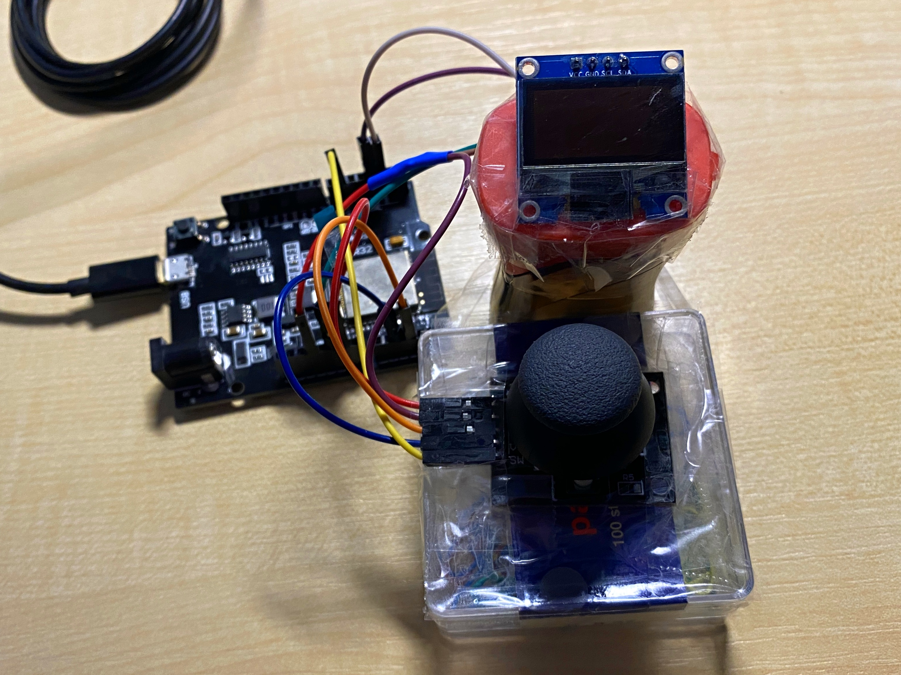
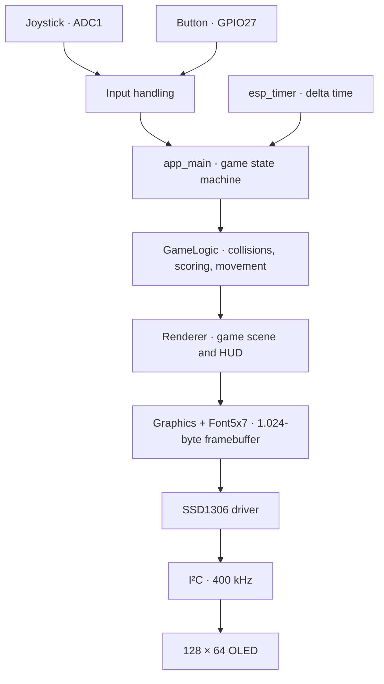

<div align="center">

# IMP – Project: Game on a Displey

## 🐝 Bee Pollination

### A tiny arcade game. A real microcontroller. One very busy bee.

A **joystick-controlled, real-time 2D arcade game** built from scratch in **C** for the **ESP32**, rendered on a **128 × 64 monochrome OLED display**.

[](https://www.espressif.com/en/products/socs/esp32)
[](https://github.com/espressif/esp-idf)
[](main/)
[](#hardware--wiring)
[](LICENSE)

**[▶ Watch the demo](https://youtu.be/jT92WX7A0JY)** · **[📖 Project report](dokumentace.pdf)** · **[🔌 Wiring](#hardware--wiring)** · **[🚀 Get started](#getting-started)**

</div>

---

## About the author and project

**Jan Kalina** · **2026**  

**Brno University of Technology** — Faculty of Information Technology  
**IMP — Microprocessors and Embedded Systems**

**Result:** 10.0/10.0 b.

This project is distributed under the **GNU General Public License v3.0**. See [LICENSE](LICENSE) for the full license text.


## Overview

**Bee Pollination** is a miniature arcade game in which you guide a bee between flowers, collect pollen, and deliver it before the clock runs out. Avoid spiders, dodge the rain, and make strategic use of temporary power-ups to maximize your score in **60 seconds**.

The game was developed as a university project for **IMP – Microprocessors and Embedded Systems** at the **Faculty of Information Technology, Brno University of Technology (FIT BUT)** in 2025. Beyond the gameplay, it demonstrates direct integration of **ADC-based analog input**, **polled GPIO input with software debouncing**, **I²C display communication**, **framebuffer graphics**, and **time-based game logic** within the **ESP-IDF / FreeRTOS** environment. The firmware uses **ESP-IDF, not Arduino**.

## Demo

<div align="center">

[](https://youtu.be/jT92WX7A0JY)

*Click the preview to watch the game in action.*

[YouTube demonstration](https://youtu.be/jT92WX7A0JY) · [Full-resolution video on Google Drive](https://drive.google.com/drive/folders/1icxXEqtqzk53VCFcV1F5xSe-IhUn7lpO?usp=drive_link)

</div>

## Features

- **Analog joystick controls** — 12-bit ADC sampling, automatic center calibration, an 8% dead zone, nonlinear response, and exponential smoothing.
- **Hand-drawn pixel graphics** — custom bee animation, flowers, spiders, raindrops, items, UI overlays, and a compact 5 × 7 font.
- **60-second score challenge** — pick up pollen at one flower, deliver it to another, and repeat with randomized flower positions.
- **Dynamic hazards** — spiders end the run on contact; falling raindrops temporarily reduce movement speed.
- **Collectible power-ups** — a protective shield and a short burst of extra speed.
- **Pause/resume and restart flow** — controlled with the joystick's integrated push button.
- **Modular firmware** — clear separation of device drivers, input processing, game logic, drawing primitives, and scene rendering.
- **Delta-time updates** — gameplay timing and movement are based on elapsed time rather than assuming a perfectly constant frame rate (approximately 30 FPS target).

## How to play

1. **Press the joystick button** on the title screen to begin. Keep the joystick centered during the brief calibration.
2. **Move the bee** with the joystick to the *source flower*. Stay there for approximately **1.2 seconds** to collect pollen; the on-screen progress bar shows your progress.
3. **Fly to the target flower** to deliver the pollen and score **1 point**. A new pair of flowers appears for the next delivery.
4. **Get as many deliveries as possible** before the **60-second** timer expires — but avoid unprotected contact with spiders.

| Object | Effect |
| --- | --- |
| 🌸 **Source flower** | Remain nearby to collect pollen. |
| 🎯 **Target flower** | Deliver collected pollen to earn a point. |
| 🕷️ **Spider** | Ends the game on contact unless a shield is active. |
| 💧 **Raindrop** | Slows the bee to **50% speed for 3 seconds**. |
| 🛡️ **Shield** | Protects the bee for up to **5 seconds**; consumed when it blocks a spider. |
| 🍯 **Honey** | Boosts the bee's speed to **150% for 3 seconds**. |

**Controls:** Move the joystick to steer. Press its button to **start**, **pause**, or **resume**. On the game-over screen, press the button to return to the title screen and start another run.

## Hardware & wiring

The original build uses a **WeMos D1 R32 (ESP32)** development board, an **SSD1306 OLED display (128 × 64, I²C)**, a **two-axis analog joystick with push button**, and jumper wires.

<div align="center">
  
  <p><em>Physical prototype of the Bee Pollination game console.</em></p>
</div>

| Peripheral | Signal | ESP32 connection | Notes |
| --- | --- | --- | --- |
| Joystick | VRx / X | **GPIO34** | ADC1 channel 6 |
| Joystick | VRy / Y | **GPIO35** | ADC1 channel 7 |
| Joystick | SW | **GPIO27** | Active-low input with internal pull-up |
| OLED (SSD1306) | SDA | **GPIO25** | I²C data |
| OLED (SSD1306) | SCL | **GPIO26** | I²C clock |
| Joystick + OLED | VCC | **3.3 V** | Power supply |
| Joystick + OLED | GND | **GND** | Common ground |

The OLED operates at **I²C address `0x3C`**, using **400 kHz** fast-mode communication. The joystick is sampled through **ADC1** with **12-bit resolution**.

> [!IMPORTANT]
> This wiring is intended for **3.3 V logic**. Do not apply 5 V signals directly to ESP32 GPIO pins. Verify your specific OLED module's supply-voltage requirements before powering it.

## Getting started

### Requirements

- An **ESP32 development board** (the reference hardware is the WeMos D1 R32).
- An **SSD1306-compatible 128 × 64 I²C OLED**, a two-axis analog joystick with a button, and the connections above.
- **ESP-IDF 5.5.x** installed and its environment activated. The repository's `sdkconfig` was generated with **ESP-IDF 5.5.1**.
- A suitable **USB data cable** and the board's USB-to-serial driver, if required by your operating system.

Follow Espressif's [official ESP-IDF installation guide](https://docs.espressif.com/projects/esp-idf/en/v5.5.1/esp32/get-started/index.html) if you have not installed the toolchain yet.

### Build and flash

Open an **ESP-IDF-enabled terminal** in the repository root and run:

```bash
# Configure the firmware for the original ESP32 target (if needed)
idf.py set-target esp32

# Compile the application
idf.py build

# Flash the board and open its serial monitor
idf.py -p PORT flash monitor
```

Replace `PORT` with your board's serial port, such as `COM5` on Windows or `/dev/ttyUSB0` on Linux. If the target is already correctly configured, the `set-target` step can be omitted. **Note:** `set-target` regenerates the project's configuration; review custom settings if you change targets.

To exit the ESP-IDF serial monitor, press **Ctrl+]**.

After flashing, the OLED should display the **Bee Pollination** title screen. Press the joystick button and leave the stick centered until calibration completes.

### Troubleshooting

| Symptom | What to check |
| --- | --- |
| OLED stays blank | Confirm power, GND, SDA on GPIO25, SCL on GPIO26, and the expected I²C address `0x3C`. |
| Joystick movement is incorrect | Verify VRx → GPIO34 and VRy → GPIO35, then restart the game with the stick centered for calibration. |
| Button does not respond | Verify SW → GPIO27 and that the joystick shares ground with the ESP32. |
| Flashing fails | Verify the serial port, USB data cable, drivers, and whether the board needs to be placed in download mode. |
| Build fails | Confirm that the ESP-IDF environment is active and that the installed version is compatible with 5.5.1. |

## Software architecture

The firmware separates the **hardware abstraction**, **game state**, and **rendering pipeline**. `app_main()` owns the main loop and a finite-state machine for the title screen, calibration, active gameplay, pause, and game-over states.



The scene is first composed in an **in-memory 1,024-byte framebuffer** and then sent to the SSD1306. Drawing primitives include pixels, lines, rectangles, circles, ellipses, and text. Physics, effects, and countdown timers use the measured elapsed time (`deltaTime`), with the main loop targeting approximately **30 FPS**.

<details>
<summary><strong>Project structure</strong></summary>

```text
.
├── CMakeLists.txt          # ESP-IDF project definition
├── sdkconfig               # ESP32 / ESP-IDF configuration
├── main/
│   ├── main.c              # Entry point, initialization, FSM, main loop
│   ├── CMakeLists.txt       # Component registration
│   ├── public/              # Public module APIs (headers)
│   ├── source/              # Device drivers, game logic, graphics, renderer
│   ├── structure/           # Game and entity data structures
│   └── enum/                # Game-state and power-up enumerations
├── doc/                     # LaTeX report sources and hardware photos
├── dokumentace.pdf          # Complete university project report (Czech)
├── LICENSE                 # GNU GPL v3
└── README.md
```

**Key modules:** `Joystick` and `Button` handle input; `I2C` and `SSD1306` communicate with the screen; `Graphics` and `Font5x7` provide low-level drawing; `GameLogic` updates gameplay; `Renderer` draws the game state and HUD.

</details>

## Documentation

The accompanying [project report (PDF, in Czech)](dokumentace.pdf) covers the hardware selection, connections, implementation architecture, frame timing, rendering, and final prototype. Its [LaTeX source](doc/main.tex) and hardware photographs are also included in the repository.
